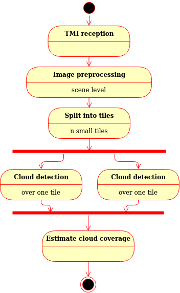
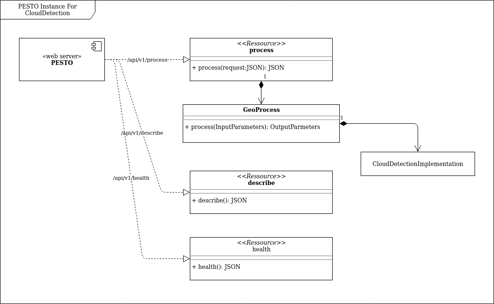
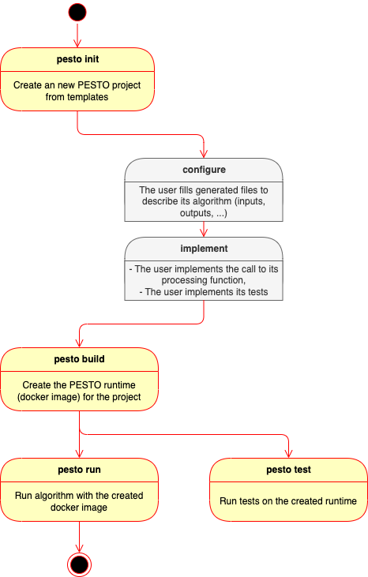
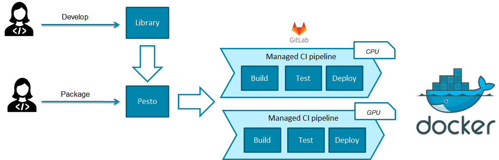
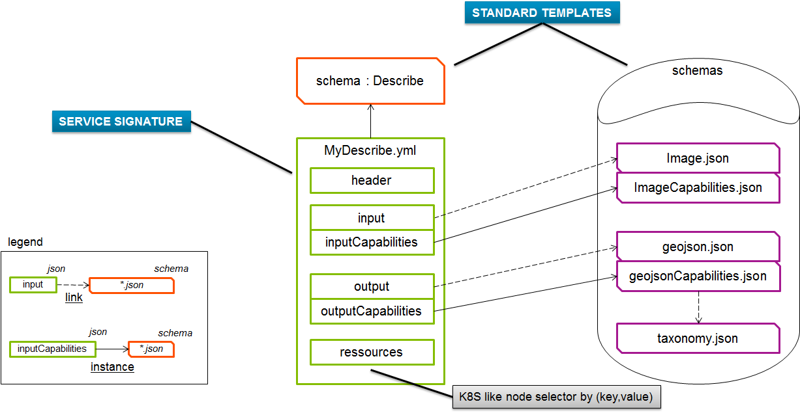
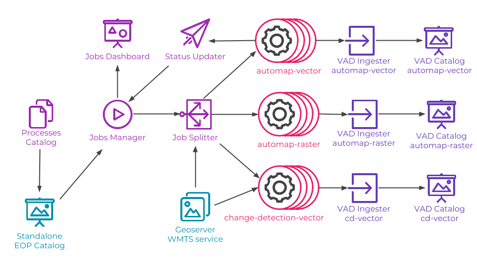
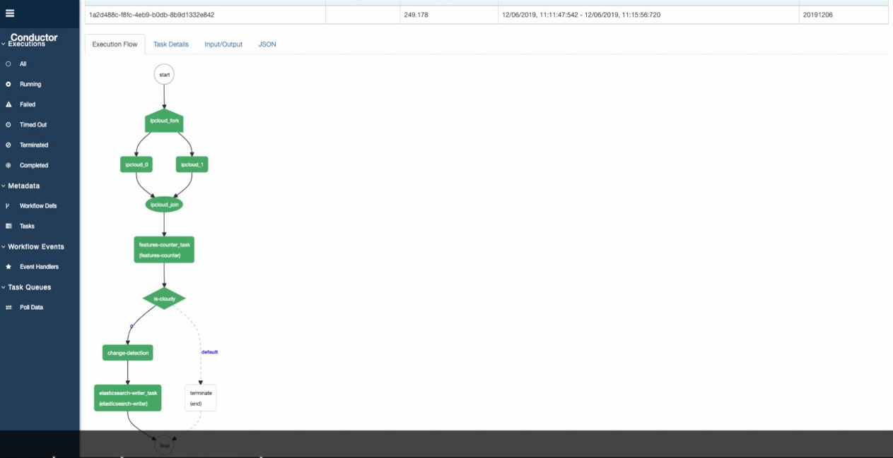

# Design presentation

## Introduction

PESTO stands for ProcESsing facTOry and was initially designed to answer the need for fast and efficient integration of image processing algorithms using deep learning (DL) in our ground segment products.

Next sections are organized as follows: 

* Need identification: this section presents the expectations, what we would like to do.
* Base architecture identification: this section details the architecture of Pesto. It describes how we answer to our objectives.
* Processing API management: this section provides guidelines on how to design a processing API for PESTO.
* Performances: this section tells how PESTO should perform, how we demonstrated it was scalable.
* Who uses PESTO: this section provides a list of projects / products that are using PESTO. 

## Need identification
The road from the design and development of a DL algorithm by data scientists to their integration in the image chain and finally the ground segment can be fastidious due to all the teams and all the required skills involved along the integration chain. Moreover, a DL solution, like cloud detection for instance, will usually be included in different products of our offer (like PNEO, DIGINEO or OneAtlas) having their own integration technologies, constraints and specificities. In addition, DL algorithms are frequently updated, either when the training dataset or the model is modified.
Therefore, we can’t afford to have an integration effort too long and complex, for each algorithm in each of our product.  

It is then clear that standardizing key APIs, defining a common process and sharing common tools could greatly facilitate the delivery of DL algorithms and by extension of data processing algorithms, either delivered by our providers or designed by ourselves.

From these remarks and an analysis of what should be PESTO, a base architecture is proposed in the next section.

## Base architecture definition

Let’s take the widespread use case of cloud detection on satellite imagery in order to introduce the main integration steps and possibilities. A classical workflow applied when images are received is presented in Figure [Cloud Detection Pipeline](#fig-ipcloud )

*<a name="fig-ipcloud">Figure: Illustration of a cloud detection pipeline</a>*

As we see, the cloud detection algorithm is integrated in a global image processing chain that will trigger many instances of it. Indeed, large scene images has to be split in smaller images that are compatible with the algorithm (RAM or GPU memory limit), and the processing needs to be distributed to provide high processing throughput and low latency. PESTO should then facilitate the integration of processing algorithms in various distributed processing frameworks used in our products. 

In the current illustration, the algorithm processes images as they are received, but it might also be on user request for on-demand processing or based on an event triggered by a monitoring function in other scenario. PESTO should then facilitate the reuse of processing algorithms by various orchestrators used in our products.

The described pipeline does not detail the type and format of the data that is exchanged in between tasks. For image tiles, it could be a binary buffer containing the image itself or an URL pointing to a file to be fetched. Moreover, the information could be provided by different technologies (HTTP/REST, Apache KAFKA bus, SOAP,...). It will depend on the solution selected at the system level. But in any manner, the processing algorithm will need the image data. PESTO should then facilitate the definition of algorithms API and encourage the definition and use of common data types.

And as it was mentioned several times, the processing algorithm needs to be deployed in many places. Therefore, PESTO should allow implementing the strategy *develop and validate once, deploy everywhere*.

The base architecture of PESTO is then derived from these needs. PESTO is composed of a runtime proper to each processing function, a packaging manager to create PESTO runtimes tuned for each processing function and a testing framework.

### PESTO runtime

The runtime is a webserver which conforms to an OpenAPI specification. The OpenAPI Specification (OAS) defines a standard, language-agnostic interface to RESTful APIs which allows both humans and computers to discover and understand the capabilities of the service without access to source code, documentation, or through network traffic inspection. When properly defined, a consumer can understand and interact with the remote service with a minimal amount of implementation logic, see [SWAGGER](https://swagger.io/specification/).

The architecture of the runtime is presented in Figure [PESTO instance for cloud detection](#fig-pestocloud )

*<a name="fig-pestocloud">Figure: Architecture of a PESTO runtime for cloud detection</a>*

PESTO web server offers three web services that are :
- /api/v1/health: it provides information on the availability of the service,
- /api/v1/describe: it provides information on the processing service that is deployed. Information on inputs, outputs, deployment requirements and so on are given here. PESTO does not constrain the definition of input and output parameters to offer a versatile solution. In return, a standardization effort has to be conducted in parallel.
- /api/v1/process: call the processing function. Request parameters must respect the definition provided by /api/v1/describe.

PESTO is also in charge to convert, when required, the data from the REST API to the processing API. For most of parameters, they won’t be any major conversion. In the current implementation, only the image type is converted such that the processing has access to the image data as a buffer. The philosophy is to remove any I/O operations from the algorithm implementation to limit the any adherence with the data source or destination.

The runtime is provided as a standalone docker image that can be deployed everywhere and how many times as necessary.

### PESTO packaging manager

The packaging manager is a set of tools and templates to help the data scientist to deliver its algorithm. Indeed, one goal of PESTO is really to ease the delivery of an algorithm designed by a data scientist.

The packaging workflow is described in Figure [PESTO packaging workflow](#fig-pestoworkflow )

*<a name="fig-pestoworkflow">Figure: PESTO packaging workflow</a>*

 

### PESTO testing framework

PESTO provides mechanisms to test the embedded processing function. A set of input and expected output parameters are provided by the data scientist. Then, the test function deploys the PESTO runtime and run tests.

## Implementation details

PESTO is developed with Python3. Indeed, many Deep Leaning tools and frameworks are provided in this language. Moreover, Python can easily use native code if necessary.

[SANIC](https://sanic.readthedocs.io) is used to implement the webserver. It offers async operations which allow to write non-blocking code.

In order to make the link between requests on the web server and the processing implemented by the data scientist, a template to implement a python package and to provide a description of the API as well as build requirements is provided. 

The python package is named algorithm.process.Process. The data scientist needs to fill the signature and the content of the process function and in particular include the call to the implementation of the processing function.

Then a set of configuration files have to be updated. A first set of configuration files (located in pesto/api) defines the API of the algorithm. Their content is described in the next section.

A second set of configuration files (located in pesto/build) defines how to build the runtime. We can define which root docker image to use, how to include DL models and parameters in the runtime, the name and version of the runtime,... One additional feature is the possibility to define several independent runtime profiles. For example, it is useful to define a runtime using only CPUs and a runtime using the GPU. 

The process is depicted in Figure [PESTO packaging workflow](#fig-pestoworkflow2 )

*<a name="fig-pestoworkflow2">Figure: PESTO packaging workflow</a>*

One last implementation detail that is worth to mention, is the management of the image type. The REST API allows to pass an image either as a string designating an image file (either on a web server, on the disk, or in a GCP storage) or an image raw buffer encoded in base64. PESTO is then in charge to fetch the data and to provide it to the algorithm.

## Processing API management

The PESTO runtime is designed to be extremely versatile by letting a full freedom on the definition of interfaces. The solution can then address many, if not all, use cases, which makes it its strength. 

PESTO does not guarantee the interoperability of processing functions which is also a key element in our ground segment solutions. Therefore, a complementary effort is conducted to standardize common data types in order to enforce interoperability.

PESTO recommended philosophy is then to capitalize JSON Schema defining data types as well as functions used to convert from the REST API type to the algorithm type (like it is done for images).
 
This effort has been conducted for Earth Observation data processing jointly with Airbus Defense and Space / Connected Intelligence teams. A common API, named geoprocessing-api, was then defined and can be found [here](https://github.com/AirbusDefenceAndSpace/geoprocessing-api).

We provide here some guidelines to define and manage JSON Schema used to define API.

* Define common data types and rely on existing ones as much as possible to ease interoperability,
* Define data types that can be managed by higher level orchestrators: they need to known data types to provide the right information in the right format, possibly calling converters,
* Define API that will allow to chain processing function.

The definition of processing API should then be organized as depicted in Figure [Processing API management](#fig-apimanagement)

*<a name="fig-apimanagement">Figure: Processing API management</a>*

* MyDescribe.yml: 

	** Declares features of the process. It is used by orchestrators to select a service, deploy its docker image, feed it with the right data and exploit its result,

	** The Format is extremely open to support any type of micro-service, however it is already batch processing compliant.

* Default data types for GeoApplications:

	** image.json: Declares the format of an image and its attributes: compression type, spectral bands, sensor, ephemeris.

	** imageCapabilities: Declares how to specify filters describing supported images.

	** inputCapabilities: gather together all possible input capabilities of the project, somehow it references ImageCapabilities.json

## Performances

PESTO runtime is a wrapper around the algorithm to make it available as a web service. It transfers inputs and outputs from one side to the other. The intrinsic performances, i.e. performances related to the goal of the function like the detection rate for object detection, of the algorithm are not altered by PESTO. It can eventually add a little processing time or latency overhead, i.e. extrinsic performances. But PESTO should not affect them in a significative way as it simply passes REST API arguments to the algorithm. It should provide equivalent overhead on extrinsic performances as any web service implementation.

The memory overhead, that also characterizes the extrinsic performances, has not been evaluated yet. But in our use cases involving image processing, it should remain negligible.

PESTO has been deployed at scale in Google Cloud Platform to process large satellite imagery. The architecture of the deployed system is presented in Figure [PESTO at scale for EO processing with GPU](#fig-pestoatscale). PESTO runtimes are identified with the icon . The platform was created with 3 GPU workers and 13 workers (with 8 CPU each) for PESTO runtimes.

*<a name="fig-pestoatscale">Figure: PESTO at scale for EO processing with GPU</a>*

PESTO has also been deployed at larger scale with [Conductor](https://netflix.github.io/conductor/) (Orchestrator from Netflix) to run a pipeline of two tasks provided as PESTO micro services, see Figure [PESTO at scale with Conductor](#fig-pestowithconductor). 100 workers for PESTO were created.

*<a name="fig-pestowithconductor">Figure: PESTO at scale with Conductor</a>*

## Who uses PESTO

PESTO is currently used by Airbus Defense and Space / Connected Intelligence.

PESTO is under integration by the Airbus Defense and Space / Space Systems Oasis project. It is used to integrate and manage algorithms for TM/TC analysis.

PESTO is under integration by Airbus Defense and Space / Space Systems in its ground segment image chain.

Workshops have been taking place with end-users in order define a solution that first could be integrated in our ground segment product lines. They have contributed to the definition of the product and have validated its integration in their own software stack.

## PESTO roadmap

PESTO was thought to accelerate the integration in our products of Deep Learning algorithms, being developed by Airbus or by partners. That is why, one of the first priorities is to make it open source.

PESTO was initially designed for image processing in mind. Some specificities were then included in the runtime. Our second priority is to set up mechanisms to include user data converters as plugins and to support various Linux families.

PESTO needs to be orchestrated. Simple tutorials and examples to deploy PESTO at scale and manage distributed processing have to be written in order to foster its acceptance by the community.

PESTO testing and deployment framework still need additional effort to offer a complete workflow towards continuous deployment and validation.

